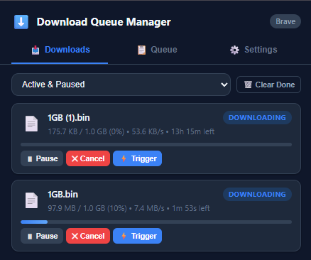
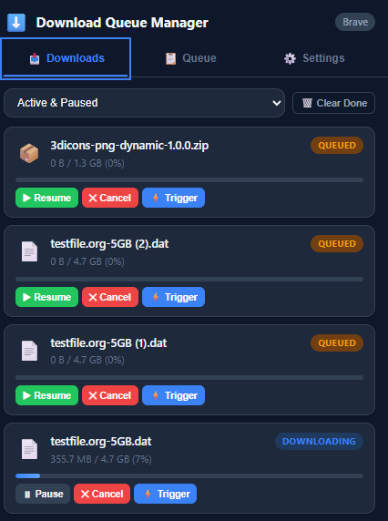
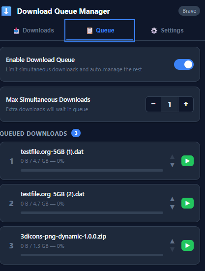
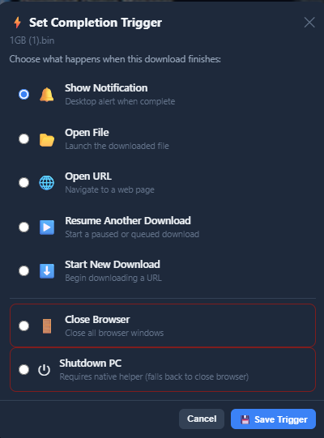
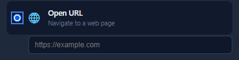
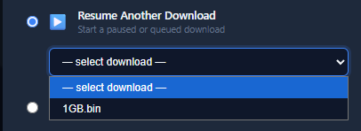
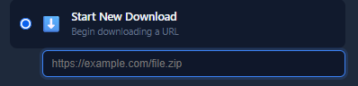
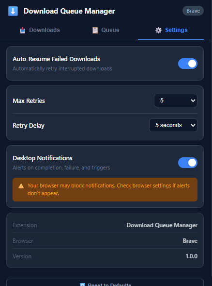

# Download Queue Manager

Advanced download manager extension for Chromium-based browsers.

## Browser Support

| Browser        | Status         | Install From     |
| -------------- | -------------- | ---------------- |
| Google Chrome  | ✅ Full support | Chrome Web Store |
| Microsoft Edge | ✅ Full support | Edge Add-ons     |
| Brave          | ✅ Full support | Chrome Web Store |
| Opera          | ✅ Full support | Opera Add-ons    |
| Vivaldi        | ✅ Full support | Chrome Web Store |
| Arc            | ✅ Full support | Chrome Web Store |
| Chromium       | ✅ Full support | Manual install   |
| Yandex Browser | ✅ Full support | Chrome Web Store |

## Features

### ⚡ Download Triggers

Assign completion actions to any active download:

* Show desktop notification
* Open the downloaded file
* Open a URL
* Resume another download
* Start a new download
* Close the browser
* Shutdown PC (with native helper)

### 🔄 Auto-Resume

* Automatic retry for interrupted downloads
* Configurable retries (1-20) and delay (3-60s)
* Smart error handling (won't retry user cancels or permission errors)
* Global enable/disable toggle

### 📋 Download Queue

* Set max simultaneous downloads (1-10)
* Auto-pause excess downloads
* Auto-resume when slots open
* Reorder queue priority

## Screenshots

### Download Manager




### Download Queue



### Download Triggers






### Settings



## Development Setup

```bash
# 1. Clone the repo

git clone <repo-url>

cd download-manager-pro

# 2. Generate icons

# Open icon-generator.html in browser
# Right-click each canvas → Save as icons/icon16.png, icon48.png, icon128.png

# 3. Load in browser

# Chrome:  chrome://extensions → Developer mode → Load unpacked
# Edge:    edge://extensions → Developer mode → Load unpacked
# Brave:   brave://extensions → Developer mode → Load unpacked
# Opera:   opera://extensions → Developer mode → Load unpacked
# Vivaldi: vivaldi://extensions → Developer mode → Load unpacked
```
